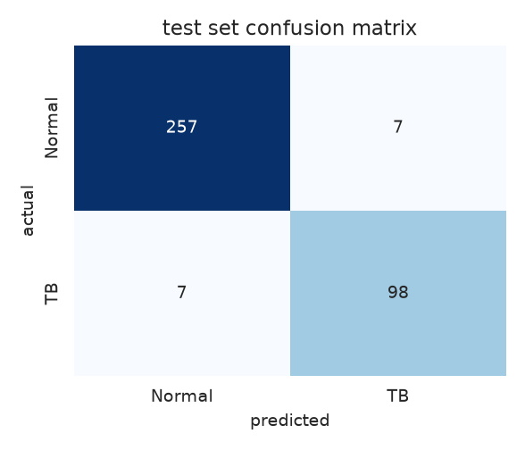
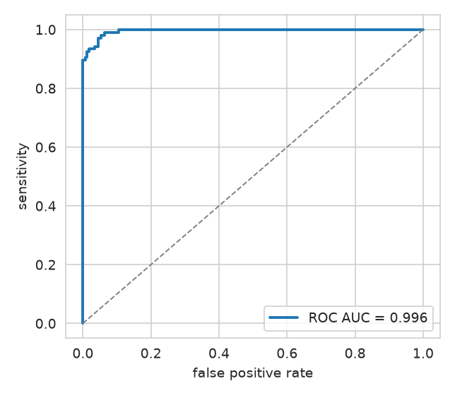
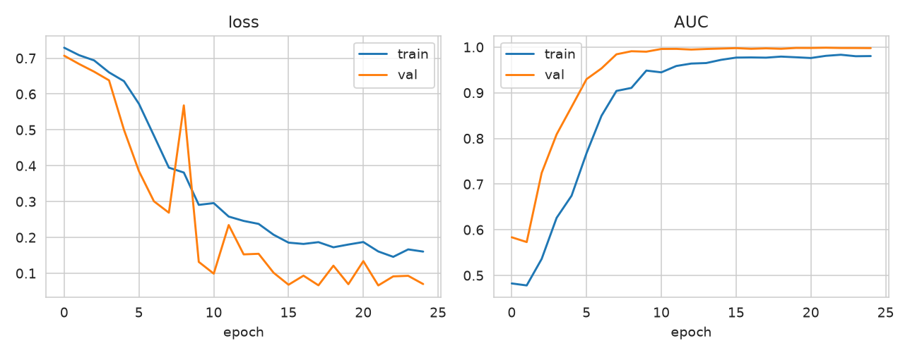
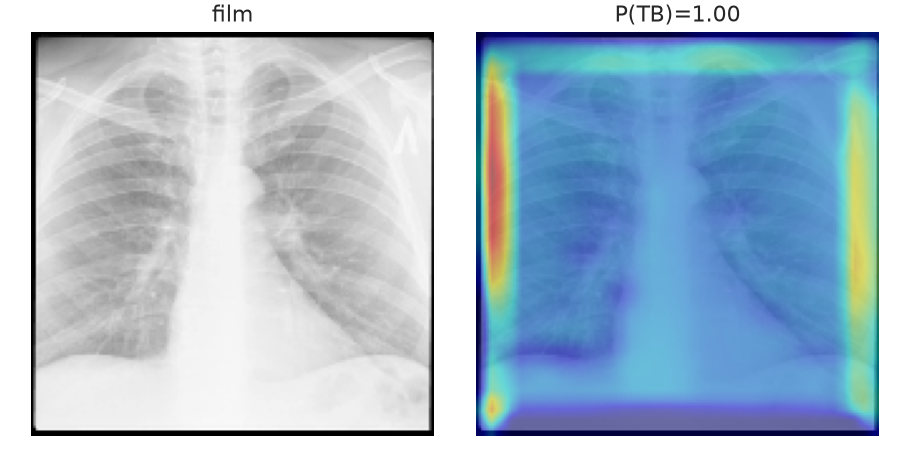
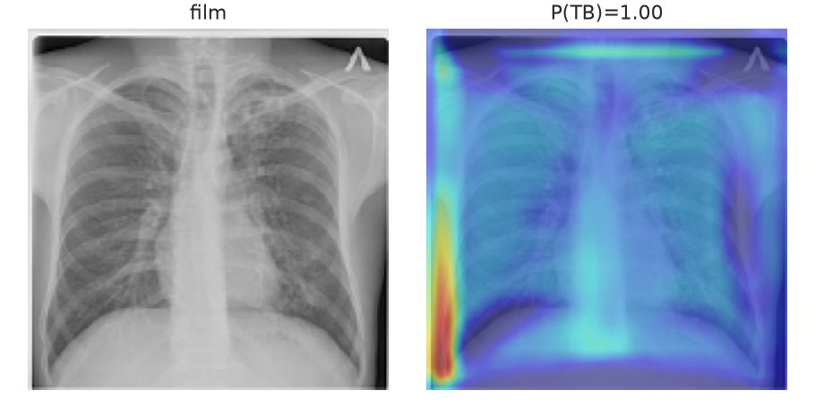
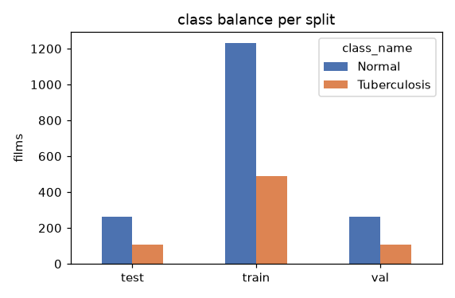
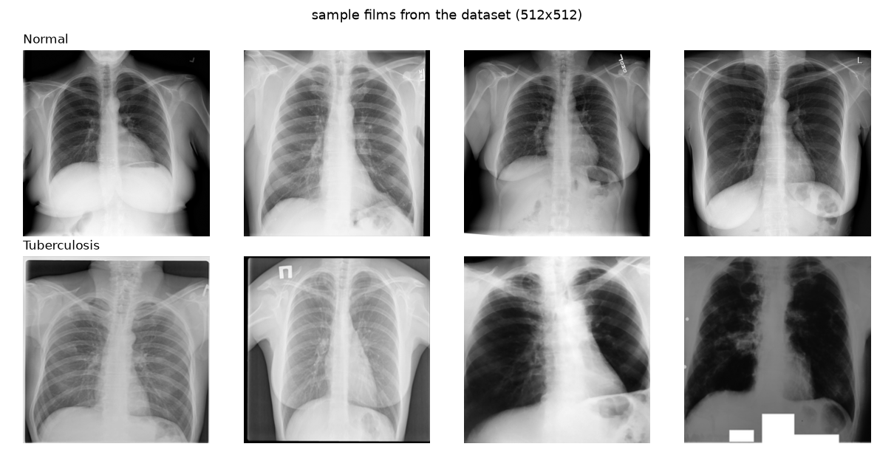

# Tuberculosis detection on chest X-rays

Binary classifier that flags tuberculosis on frontal chest radiographs. Built
to be run by an ordinary human on an ordinary machine: no GPU worship, no 90
line YAML configs, no mystery notebooks. You pull the data, run one command,
and you get a model plus the numbers to judge it with.

> **This is a screening aid for research/teaching, not a diagnostic device.**
> Don't put it between a patient and a decision.

## Results

Held-out test set: 369 films (264 normal, 105 TB), stratified, frozen in
`data/splits.csv` so the numbers below can't quietly drift between runs.

| metric | value |
| --- | --- |
| accuracy | 0.962 |
| balanced accuracy | 0.953 |
| sensitivity (TB recall) | 0.933 |
| specificity | 0.973 |
| precision (TB) | 0.933 |
| F1 (TB) | 0.933 |
| ROC AUC | 0.996 |
| PR AUC (avg. precision) | 0.990 |

Confusion counts: TP 98, FN 7, TN 257, FP 7. Seven missed
TB films out of 105 - worth staring at before celebrating. Trained 25
epochs in ~48 minutes on 2 CPU cores; best checkpoint picked
by validation AUC.





Grad-CAM on test films, so we can see what the network thinks "tuberculosis"
looks like (it should be lighting up the lung fields, not the text markers —
check before you trust):




## Dataset

The **Tuberculosis (TB) Chest X-ray Database** by Tawsifur Rahman et al.
([Kaggle](https://www.kaggle.com/datasets/tawsifurrahman/tuberculosis-tb-chest-xray-dataset)):
700 TB positive and 3500 normal films, 512x512, grayscale, de-identified and
released for research. I trained on a 1760-normal subsample, so 2460 films
total, split 70/15/15 stratified:

 

Get it onto your disk with:

```bash
python scripts/download_data.py --normal 1760
```

That pulls from a public GitHub mirror of the Kaggle set (no Kaggle account
needed). If you have the Kaggle CLI configured, downloading the original and
unzipping it so `data/raw/Normal/` and `data/raw/Tuberculosis/` exist works
just as well.

## Layout

```
src/tb_detection/
    config.py     # one dataclass with every knob. that's the config system.
    data.py       # scanning, frozen stratified splits, tf.data pipeline
    model.py      # compact from-scratch CNN (~300k params)
    train.py      # training + evaluation entry point (tb-train)
    evaluate.py   # metrics, curves, confusion matrix
    gradcam.py    # Grad-CAM heatmaps
    predict.py    # single-film CLI (tb-predict)
scripts/download_data.py
tests/            # pytest, 11 tests
outputs/results/  # metrics.json + figures (tracked in git)
```

## Reproduce

```bash
python -m venv .venv && source .venv/bin/activate
pip install -r requirements.txt
pip install -e .

python scripts/download_data.py --normal 1760
pytest -q          # sanity: 11 passed
tb-train           # ~35 min on 2 CPU cores, writes outputs/results/
tb-predict some_cxr.png --cam cam.png
```

`tb-train` stores the best checkpoint (by val AUC) at
`outputs/models/tb_cnn.keras`, and dumps metrics + figures to
`outputs/results/`. The split is created once into `data/splits.csv`; delete
that file if you want a different random split.

## Notes on the model

A small ConvNet trained from scratch, roughly 300k parameters, 160x160 input:
three conv-GN-ReLU blocks with pooling, GAP head, dropout. Augmentation
(horizontal flip, small rotation/zoom/contrast) lives inside the model graph,
so it can't leak into inference. Loss is plain BCE with Adam at 3e-4,
gradient-norm clipping, class weights to counter the imbalance, early
stopping on val AUC.

Two scars from actually training this thing:

1. **BatchNorm betrayed me here.** Train AUC marched happily past 0.9 while
   validation predictions collapsed to "TB for everyone". The moving stats got
   poisoned in the first epochs and never recovered (train mode uses batch
   stats, so training looked fine, which is the rude part). Swapped to
   GroupNormalization - per-sample stats, no train/inference state, problem
   gone. If you ever inherit a repo where train metrics shine and val metrics
   look drunk, check the normalization layers first.
2. On this dataset accuracy alone is flattering garbage. At 2.5:1 normal-to-TB,
   a lazy model scores 71% by doing nothing. Track sensitivity and the PR
   curve; a TB screener that misses positives is a paperweight.

## Limitations

- 160px input throws away real resolution. Fine for a baseline, less fine for
  subtle miliary patterns. If you have a GPU, raise `img_size` in `config.py`.
- The dataset mixes sources with very different acquisition characteristics.
  It generalises within this dataset - external validation on, say, Shenzhen
  or Montgomery films is the honest next step.
- Class priors in the data (~28% TB in test) are nothing like a real screening
  population, so raw precision at 0.5 threshold is not what a clinic would see.
  Tune the threshold on the PR curve for whatever operating point you need.

## License

MIT. Dataset belongs to its original authors; respect their terms.
